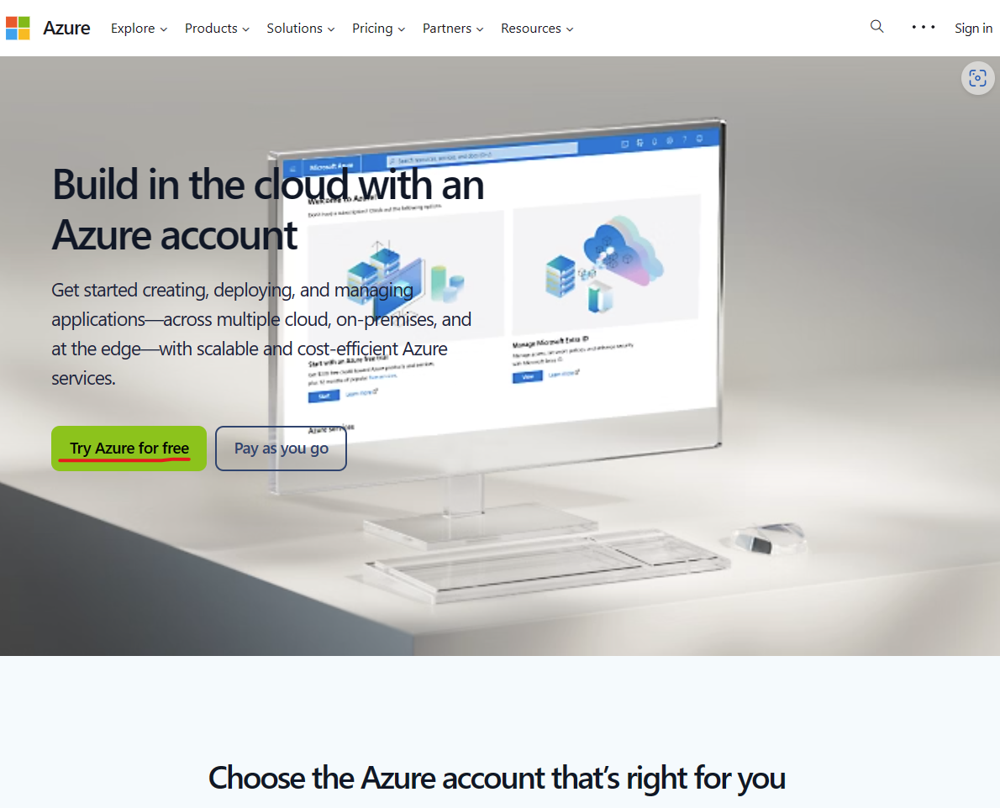
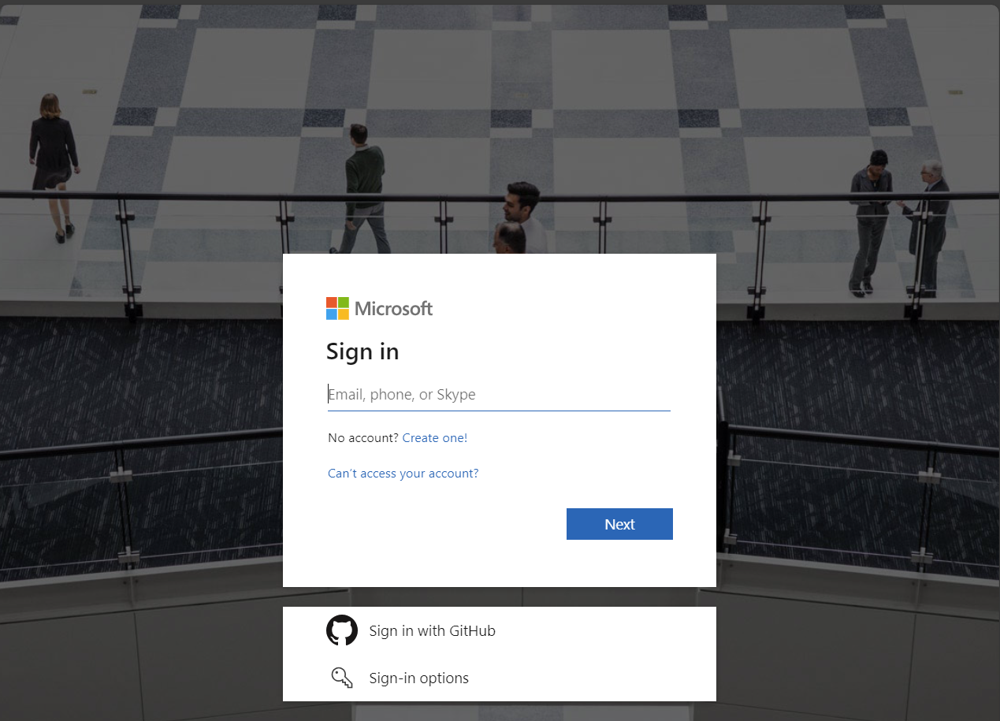
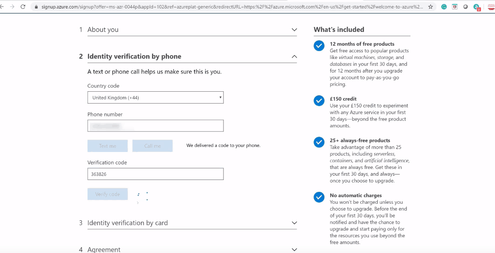
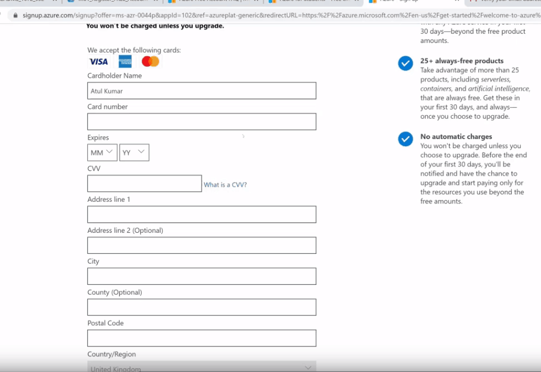

W ciągu pierwszych 30 dni od utworzenia bezpłatnego konta platformy Azure masz środki w walucie rozliczeniowej w wysokości 200 USD do użycia w dowolnej usłudze, z wyjątkiem zakupów w witrynie Marketplace innych firm. Korzystając z bezpłatnych środków, możesz poeksperymentować z różnymi warstwami i typami usług platformy Azure, aby wypróbować platformę Azure. Jeśli w tym okresie skorzystasz z usług lub zasobów platformy Azure, które nie są bezpłatne, z Twoich środków zostaną potrącone opłaty.

1. Przejdź do linku: [Azure free account](https://azure.microsoft.com/en-us/free/)

2. Zaloguj się lub utwórz nowe konto Microsoft

3. Zweryfikuj swój numer telefonu

4. Wprowadź dane karty (UWAGA: Żadna kowota nie zostanie pobrana z karty w trkacie warsztatów lub później)

5. Potwierdź dane i przejdź do portalu Azure [Azure Portal](https://portal.azure.com)