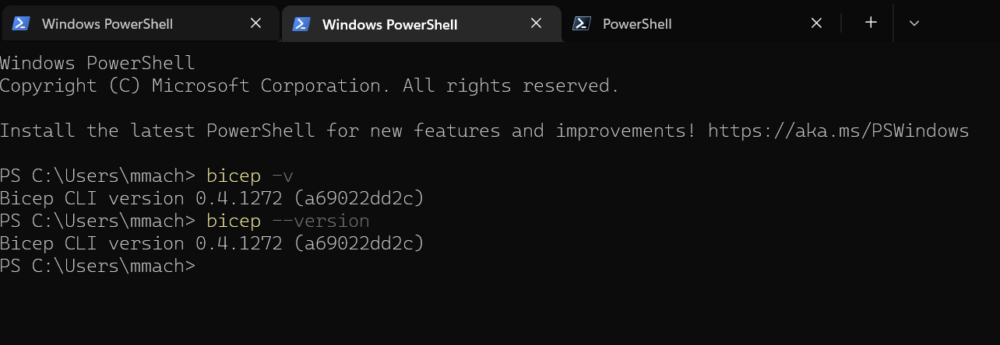

# Install and Configure local environment 

Local development environment require:

- Bicep software
- IDE like **Visual Studio Code** or any other that is supporting bicep

All software required for local development is **Free** and avalible to any platform (Windows/Mac/Linux)

## Install bicep


### Windows 

winget that is avalible for Windows 11 / Windows Server 2022 for Windows 10 need to be installed

```cmd
winget install -e --id Microsoft.Bicep
winget install -e --id Microsoft.AzureCLI
winget install -e --id Microsoft.VisualStudioCode

```

PowerShell installation of bicep 


### macOS

homebrew installtion

```sh
# Add the tap for bicep
brew tap azure/bicep

# Install the tool
brew install bicep

# Install Azure  CLI
brew update && brew install azure-cli

# Install PowerShell

brew install powershell/tap/powershell

```

bash installtion

```sh
# Fetch the latest Bicep CLI binary
curl -Lo bicep https://github.com/Azure/bicep/releases/latest/download/bicep-osx-x64
# Mark it as executable
chmod +x ./bicep
# Add Gatekeeper exception (requires admin)
sudo spctl --add ./bicep
# Add bicep to your PATH (requires admin)
sudo mv ./bicep /usr/local/bin/bicep
# Verify you can now access the 'bicep' command
bicep --help
# Done!

```

### Linux

bash installtion

```sh
# Fetch the latest Bicep CLI binary
curl -Lo bicep https://github.com/Azure/bicep/releases/latest/download/bicep-linux-x64
# Mark it as executable
chmod +x ./bicep
# Add bicep to your PATH (requires admin)
sudo mv ./bicep /usr/local/bin/bicep
# Verify you can now access the 'bicep' command
bicep --help
# Done!

# Install Azure CLI

curl -sL https://aka.ms/InstallAzureCLIDeb | sudo bash
```

### Azure CLI

Azure CLI version 2.20.0 can also install bicep

```sh

az bicep install

```

## Bicep version 

Bicep is deliver as a software so require updates and verions check, all information about bugs and feature development can be find on github https://github.com/Azure/bicep

```sh

bicep --version

# or

bicep -v

``` 



## Install Visual Studio code 

Free and built on open source. Integrated Git and oher source control.

- [Visual Studio Code for Windows/Mac/Linux](https://code.visualstudio.com/download)

### Required extensions

The following extensions are required to use in Visual Studio Code

- [Bicep extension for Visual Studio Code](https://marketplace.visualstudio.com/items?itemName=ms-azuretools.vscode-bicep)


### Recommended extensions 

The following extensions are recomendations to use witch bicep code writing

- [CodeTour extension for Visual Studio Code](https://marketplace.visualstudio.com/items?itemName=vsls-contrib.codetour)
- [Bicep Extension](https://marketplace.visualstudio.com/items?itemName=ms-azuretools.vscode-bicep)
- [ARM Tools extension for Visual Studio Code](https://marketplace.visualstudio.com/items?itemName=msazurermtools.azurerm-vscode-tools)
- [ARM Template Viewer extension for Visual Studio Code](https://marketplace.visualstudio.com/items?itemName=bencoleman.armview)
- For visibility of Bracket Pairs:
  - Use an Extension: [Bracket Pair Colorizer 2 extension for Visual Studio Code](https://marketplace.visualstudio.com/items?itemName=CoenraadS.bracket-pair-colorizer-2)
  - Use Native capability:
    - Inside Visual Studio Code, add `"editor.bracketPairColorization.enabled": true` to your settings.json, to enable bracket pair colorization.