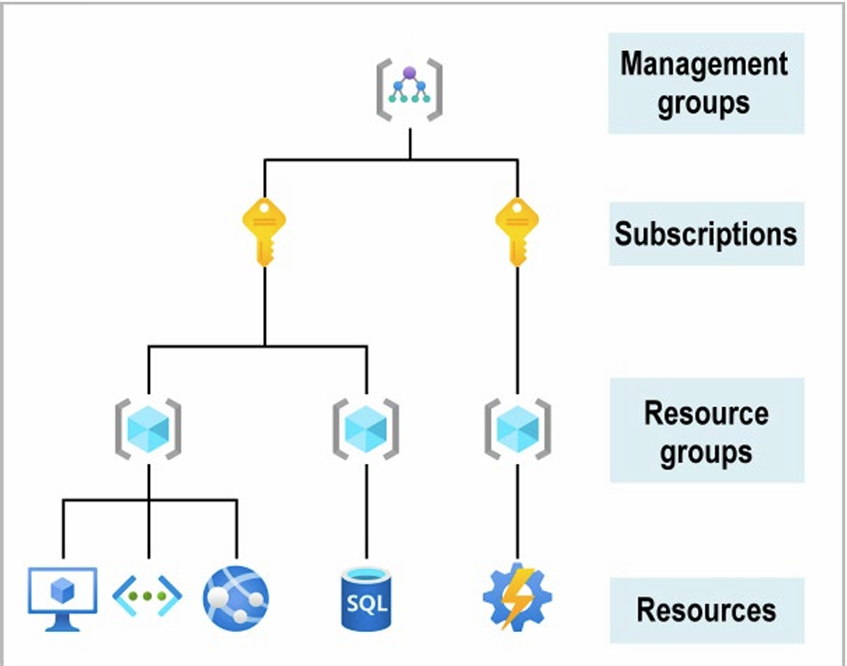
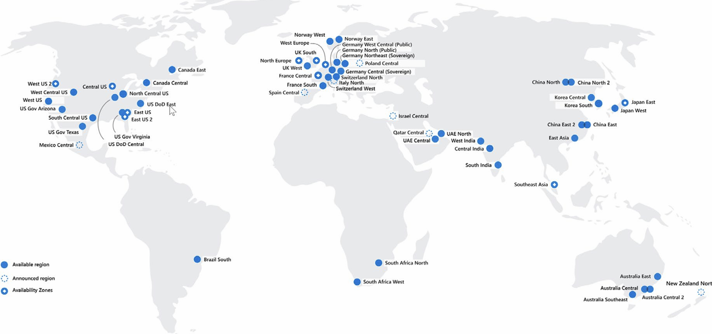
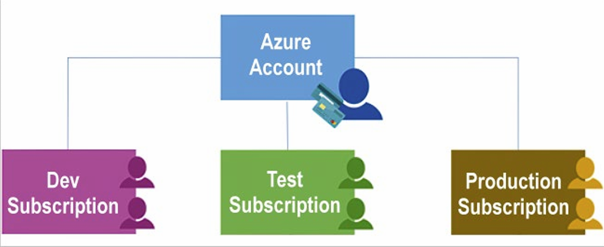
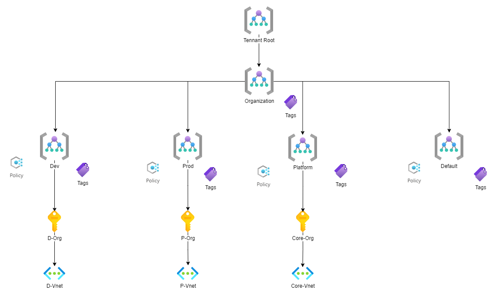
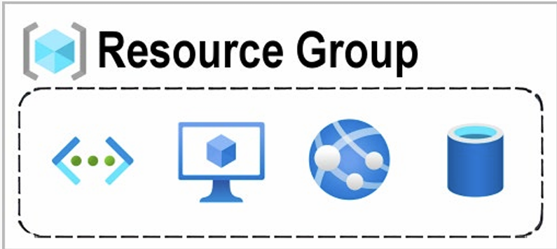

# Struktura zasobów

**Entra ID (Account):** Microsoft Entra ID to oparta na chmurze usługa zarządzania tożsamościami i dostępem, która umożliwia pracownikom dostęp do zasobów zewnętrznych. Przykładowe zasoby obejmują platformę Microsoft 365, witrynę Azure Portal i tysiące innych aplikacji SaaS. 

**Subscriptions (Subskrypcje):** rupuje konta użytkowników i zasoby, które zostały 
utworzone przez te konta użytkowników. Dla każdej subskrypcji istnieją limity lub limity przydziału dotyczące ilości 
zasoby, które można tworzyć i używać. Organizacje mogą używać subskrypcji do zarządzania kosztami i 
Zasoby tworzone przez użytkowników, zespoły lub projekty.  

**Resource groups (Grupy zasobów):** zasoby są łączone w grupy zasobów, które działają jako kontener logiczny w 
które zasoby platformy Azure, takie jak aplikacje internetowe, bazy danych i konta magazynu, są wdrażane i zarządzane.  

**Resources (Zasoby):** Zasoby to wystąpienia tworzonych usług, takich jak maszyny wirtualne, magazyn lub SQL 
Baz danych.  

**Management groups (Grupy zarządzania):** te grupy ułatwiają zarządzanie dostępem, zasadami i zgodnością dla wielu 
Subskrypcji. Wszystkie subskrypcje w grupie zarządzania automatycznie dziedziczą warunki, do których mają zastosowanie 

# Region (Loaklizacje DataCenter)

# Grupowanie zasobów 

**Grupowanie per projekt / Cost Cennter:** Podzielenie zasobów pomiędzy rożne subskrypcje, daje nam duży poziom izolacja względem:
 * Środowisk np. dev, test, prod
 * Kosztów np. Projekt Zebra, SAP
 * Struktury naszej organizacji np. Dep. IT, Dep. Finansów
 * Dostepu do zasobów np. Zespół A zarządza środowiskami Dev, Zespół A zarządza środowiskami Prod wszyscy mają prawa **Właściela**

 **Grupowanie zaosbów w Resource groups (Grupy zasobów):** Grupowanie zasobów w **Resource groups (Grupy zasobów)** umożliwia nam: 
 * Zarządzanie cyklem życia aplikacji lub tworzenie wersji aplikacji na potrzeby dewelopmentu.
 * Dostepu do zasobów - podział na mniejsze jednostki dostępowe.  

 
