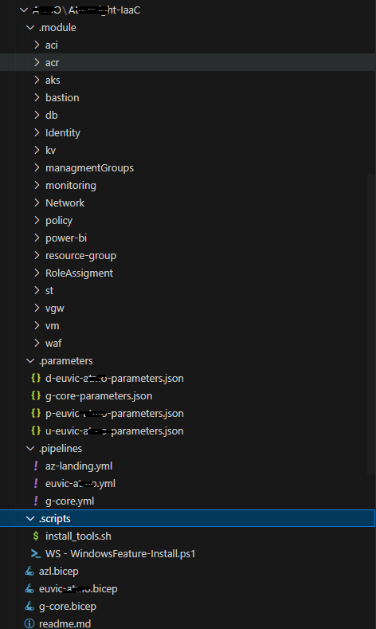

# Bicep - Files structure and namings

## Struktura pliku *.bicep

Dla wszystkich plików Bicep utworzonych w ramach tego projektu będą one zgodne ze wzorcem struktury grupowania według typu elementu, co pokazano na poniższym przykładzie.

```bicep
/*
SUMMARY: An example deployment of a resource group.
DESCRIPTION: Deploy a resource group to UK south taking a naming prefix as it's only parameter.
AUTHOR/S: Michal Machniak
VERSION: 1.0.0
*/


// SCOPE
targetScope = 'subscription' //Deploying at Subscription scope to allow resource groups to be created and resources in one deployment


// PARAMETERS
@description('Example description for parameter. - DEFAULT VALUE: "TEST"')
param par_Example_Resource_GroupName_Prefix string = 'TEST'


// VARIABLES
var var_Example_Resource_GroupName = 'rsg-${par_Example_Resource_GroupName_Prefix}' // Create name for the example resource group


// RESOURCE DEPLOYMENTS 
resource res_Example_ResourceGroup 'Microsoft.Resources/resourceGroups@2021-04-01' = {
  name: var_Example_Resource_GroupName
  location: 'uksouth'
}


// OUTPUTS
output Resource_GroupExampleID string = res_Example_ResourceGroup.id

```


## Konwencja nazewnicza

Przykład struktury nazewniczej w celu utrzymania porządku w kodzie oraz referencjach.

| Element Type | Naming Prefix | Example                                                              |
| :----------: | :-----------: | :------------------------------------------------------------------- |
|  Parameters  |     `par`     | `par_Location`, `par_Management_GroupsName_Prefix`                       |
|  Variables   |     `var`     | `var_Condition_Expression`, `var_Intermediate_Root_Management_GroupName`   |
|  Resources   |     `res`     | `res_Intermediate_Root_ManagementGroup`, `res_ResourceGroup_LogAnalytics` |
|   Modules    |     `mod`     | `mod_ManagementGroups`, `mod_LogAnalytics`                             |
|   Outputs    |     `N/A`     | `Intermediate_Root_ManagementGroupID`, `LogAnalytics_WorkspaceID` |

## Struktura plików i folderów 

Układ plików fizycznych i katalogów dla kodu infrastruktury, układ ten nie ma wpływu na proces wgrywania jest to tylko kwestia porządkowa

| Nazwa Katalogu | Poziom Folderu |
|----|----|
|.modules|0|
|.pipelines|0|
|.parameters|0|
|.scripts|0|


<p align="center">
  
</p>


## Bicep config - co  to jest
## Co  to jest moduł
